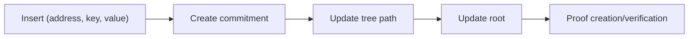
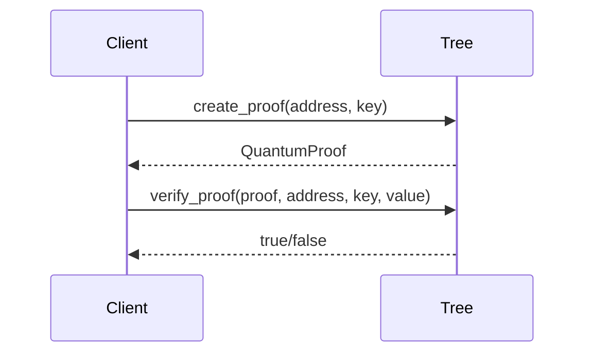

# **SpaceKit Quantum Verkle Tree**

A high‑performance, production‑oriented **Quantum-Resistant Verkle Tree implementation** designed for decentralized compute, zero‑knowledge systems, and large‑scale authenticated storage.  
This crate provides efficient key–value storage, SIS‑based vector commitments, multiproofs, range proofs, and no_std compatibility for WASM and embedded environments.

---

## **Features**

### **Quantum-Resistant Verkle Tree Core**
- Efficient authenticated key–value storage  
- Deterministic root computation  
- Proof generation and verification  
- Range proofs + multiproofs  
- `no_std` proof bytes helpers (`to_bytes` / `from_bytes`)  
- `no_std` tree snapshot helpers (`to_postcard` / `from_postcard`, `serde` feature)  

### **PQ Commitment Schemes**
- SIS-based VC (Wee–Wu) with NIST-style parameter IDs (`NistSisScheme`, `VC_SIS_128B_v1`)  
- Hash commitment scheme (`HashCommitmentScheme`) for testing/bench comparisons  
- Commitment bytes are stable for deterministic roots  
  - Reference implementation also available at `spacekit-primitives::v1::quantum::sis_vc`  
  - Params setup available via `setup_sis_params` with serialized params blobs  
  - Frozen profiles documented in `docs/VC_PARAMS.md`

### **Caching**
- Not available in PQ‑only mode.  

### **Multiproof Support (PQ)**
- Scheme‑agnostic multiproofs via `QuantumTree`  
- Batch verification over PQ commitments  
 - Multi‑open support in the SIS VC backend  

### **Range Proofs**
- Range proof generation and verification  

### **Tree Diffing**
- Not available in PQ‑only mode  

### **Testing & Validation**
- Integration tests (CRUD + proofs)  
- Property‑based tests for invariants  
- Fuzzing and benchmarking scaffolding  

---

## **🚀 Getting Started**

Minimal example:

```rust
use alloy_primitives::{Address, B256, U256};
use spacekit_quantum_verkle::new_quantum_tree;

let mut tree = new_quantum_tree();
let address = Address::from_slice(&[1u8; 20]);
let key = B256::from_slice(&[2u8; 32]);
tree.set(&address, &key, U256::from(42u64));

let value = tree.get(&address, &key).unwrap();
assert_eq!(value, U256::from(42u64));
```

Explicit params setup (SIS profiles):

```rust
use spacekit_quantum_verkle::commitment::{setup_sis_params, SisProfile, SisSecurityLevel};

let (params_id, params_blob) = setup_sis_params(SisSecurityLevel::L1, SisProfile::Binding);
```

### **CRUD + Proof Verification**

```rust
use alloy_primitives::{Address, B256, U256};
use spacekit_quantum_verkle::new_quantum_tree;

let mut tree = new_quantum_tree();
let address = Address::from_slice(&[1u8; 20]);
let key = B256::from_slice(&[2u8; 32]);
tree.set(&address, &key, U256::from(7u64));

let proof = tree.create_proof(&address, &key).unwrap();
assert!(tree.verify_proof(&proof, &address, &key, U256::from(7u64)));

tree.delete(&address, &key);
assert!(tree.get(&address, &key).is_err());
```

---

## **🧪 PQ Scheme Example**

```rust
use alloy_primitives::{Address, B256, U256};
use spacekit_quantum_verkle::commitment::{NistSisScheme, QuantumTree};

let mut tree = QuantumTree::<NistSisScheme>::new();
let address = Address::from_slice(&[1u8; 20]);
let key = B256::from_slice(&[2u8; 32]);
tree.set(&address, &key, U256::from(42u64));

let proof = tree.create_proof(&address, &key).expect("proof");
assert!(tree.verify_proof(&proof, &address, &key, U256::from(42u64)));
```

---

## **🧭 Diagrams**

### **High-level flow**



### **Proof lifecycle**



---

## **🔍 How this Verkle differs**

- Deterministic root updates and commitment handling for stable results.
- no_std-friendly proof and snapshot serialization paths for wasm/embedded.
- Optional std-only components (sha3 multiproof module) are gated cleanly.
- Post-quantum design paths are documented in `docs/PQ_DESIGN.md`.
- Scheme-agnostic tree prototype available via `QuantumTree`.
- SIS-based VC is the default via `new_quantum_tree()`.
- Hiding profile requires `set_with_aux` (caller-supplied randomness).
 - Multi‑open support is available at the VC layer for compact proofs.

---

## **🔐 Security assumptions**

- **Cryptographic primitives:** Uses an SIS-based VC (Wee–Wu) with NIST-style
  parameter IDs. Binding is enforced; hiding requires supplying aux randomness
  via `set_with_aux`.
 - **Parameters:** SIS parameter sets are versioned and serialized via params
   blobs; store and verify params IDs alongside commitments.
- **Randomness:** no_std/wasm builds must supply safe entropy if randomness is
  required by the embedding system. This crate does not provide entropy sources
  on its own.
- **Hiding mode aux:** store aux randomness per commitment; rotate aux whenever
  values are updated; never reuse aux across distinct values or contexts.
- **Side‑channels:** Constant‑time behavior is not formally audited. Treat this
  as non‑constant‑time unless proven otherwise; avoid use in high‑risk contexts
  without a dedicated review.
- **Proof soundness:** Proof verification is tied to the current root and stored
  commitments. If roots are derived from untrusted inputs, verify root integrity
  externally.
- **State integrity:** Serialization is provided via postcard; integrity (e.g.
  MAC/signature) is the caller’s responsibility when snapshots move across trust
  boundaries.

---

## **📦 Production Readiness Checklist**

| Area | Status |
|------|--------|
| Comprehensive error handling | ✅ |
| Formal VC compliance (Wee–Wu) | ✅ |
| Parameter governance (params IDs/blobs) | ✅ |
| Tree‑level multi‑open proofs | ✅ |
| Hiding mode aux handling | ✅ |
| Public API documentation & examples | ⏳ |
| Benchmarking suite | ✅ |
| Property‑based testing | ✅ |
| Stress testing with large datasets | ⏳ |
| Fuzzing (nightly) | ~ |
| CI/CD with coverage | ⏳ |

Legend: **✅ complete**, **~ partial**, **⏳ planned**

---

## **🏎 Benchmarks & Fuzzing**

Run benchmarks:

```bash
cargo bench
```

Latest results (criterion, release):
- `verkle_set_get/10`: 211.59 ms - 239.94 ms
- `verkle_set_get/100`: 1.769 s - 1.806 s
- `verkle_set_get/1000`: 17.344 s - 17.429 s
- `verkle_create_proof`: 6.788 us - 6.807 us

Run fuzzing (nightly):

```bash
cargo +nightly fuzz run proof_deserialize
```

---

## **🛰 no_std / WASM Builds**

Build for `wasm32-unknown-unknown` without `std`:

```bash
cargo build --no-default-features --target wasm32-unknown-unknown
```

Notes:
- Cache/diff/serial modules are removed in PQ‑only mode.  
- `no_std` does not alter cryptographic security; avoid swapping primitives or entropy sources when targeting WASM.

Minimal snapshot example (no_std‑friendly, requires `serde` feature):

```rust
use alloy_primitives::{Address, B256, U256};
use spacekit_quantum_verkle::{new_quantum_tree, QuantumTree};
use spacekit_quantum_verkle::commitment::NistSisScheme;

let mut tree = new_quantum_tree();
let address = Address::from_slice(&[1u8; 20]);
let key = B256::from_slice(&[2u8; 32]);
tree.set(&address, &key, U256::from(42u64));

let bytes = tree.to_postcard().expect("snapshot");
let restored = QuantumTree::<NistSisScheme>::from_postcard(&bytes).expect("restore");
assert_eq!(restored.get(&address, &key).unwrap(), U256::from(42u64));
```

---

## **🚧 Production Roadmap**

### **no_std Readiness**
Status: **in progress**  
The crate builds cleanly for `wasm32-unknown-unknown` with `--no-default-features`.  
`postcard` is used for `std`‑only serialization; expanding `no_std` serialization remains ongoing.

---

### **Phase 0 — Correctness Foundations**
**Completed**
- Deterministic root computation  
- Full keyspace path derivation  
- Removal of `unwrap`/`expect` in production paths  
- Proof creation + verification  
- Debug‑mode invariants  

**Deliverables**
- Verified roots and proofs  
- Comprehensive error types  
- Tests for empty trees, deep paths, and proof validity  

---

### **Phase 1 — Testing & Validation**
**Completed**
- CRUD + proof lifecycle tests  
- Property‑based tests  
- Multi‑proof serialization tests  

**In progress**
- Fuzzing (nightly)  
- Benchmark suite ✅  

---

### **Phase 2 — no_std + Feature Audit + Performance**
**In progress**
- Feature‑flag audit ✅  
- Incremental root updates ~  
- Avoid full‑tree cloning ~  
- Parallelizable batch operations ⏳  
- Optional bounded‑memory caching ⏳  
- Formal VC compliance (Wee–Wu spec) ✅  
- Parameter governance (frozen profiles + params blobs) ✅  
- Tree‑level multi‑open proofs ✅  
- Key/aux handling for hiding profiles ✅ (documented)

---

### **Phase 3 — CI, Fuzzing, Documentation**
Planned:
- Nightly fuzzing in CI  
- Benchmarks with published results  
- Public API examples and usage docs  

---

### **Phase 4 — Monitoring & Debugging**
Planned:
- Performance instrumentation  
- Debug logging  
- Tree visualization tools  

---

## **✅ Completed Work**

- PQ-only scheme-agnostic tree core  
- SIS-based VC (Wee–Wu) with NIST-style params  
- Proof generation + verification  
- Range proofs + multiproofs  
- Tree‑level multi‑open proofs  
- Proof serialization with params/version headers  
- Batch operations  
- Snapshot serialization via postcard (`serde` feature)  
- Error handling and test coverage  

**Planned**
- Node deduplication  
- Exclusion/membership proofs  
- Incremental updates  
- Snapshots/checkpoints  
- Debug logging  
- Visualization tools  

---

Made with ❤️ by the SpaceKit.xyz Team

